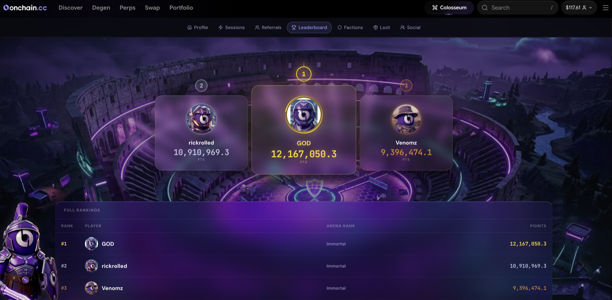

# Leaderboard

The leaderboard is the scoreboard: where you rank against every other trader in the current session, live.

***

## What It Shows

For each trader on the session leaderboard:

* **Position** — current standing in the session
* **Score** — points (or the session's stated metric) earned this session
* **Volume** — trading volume for the session
* **Rank badge** — their Colosseum rank (Recruit through Immortal)
* **Movement** — up, down, or holding since the last update

Your own row is always highlighted, wherever you rank.

<figure><figcaption>
The session leaderboard
</figcaption></figure>

***

## Session vs. Global

| Leaderboard | Scope | Resets |
| --- | --- | --- |
| **Session** | Points earned during the current session only | Every session starts from zero |
| **Global** | Lifetime points and rank across everything | Never — your full history |

The **session leaderboard decides prizes**. Your position when the session closes is what pays.

***

## How Prizes Pay Out

At session close, the leaderboard is final and the prize pool is distributed across the prize zone (the paying positions) — weighted to the top, first place taking the largest share. Session rules state the exact structure, and some sessions pay in loot boxes rather than USDC.

**Payouts follow about a week after the session ends** — a verification window runs before funds move to winners.


Standings near the prize cutoff often shift in the final hours of a session — positions aren't safe until the clock runs out.


***

## How to Climb

1. **Trade volume** — points are a function of volume, on every product.
2. **Raise your rank** — a permanently higher boost on everything you earn.
3. **Join an active faction** — the weekly faction boost stacks on top ([Factions](factions.md)).
4. **Hit the Bonus Windows** — check the dashboard and plan sessions around them.
5. **Clear your quests** — quest points build your rank, and a higher rank boosts the points every trade puts on the session board.
6. **Stack it all** — rank + faction + window at once is how the top of the board earns.

***

## Where to Find It

Open the **Colosseum** tab — the leaderboard is on the main dashboard, with a toggle between Session and Global views.
