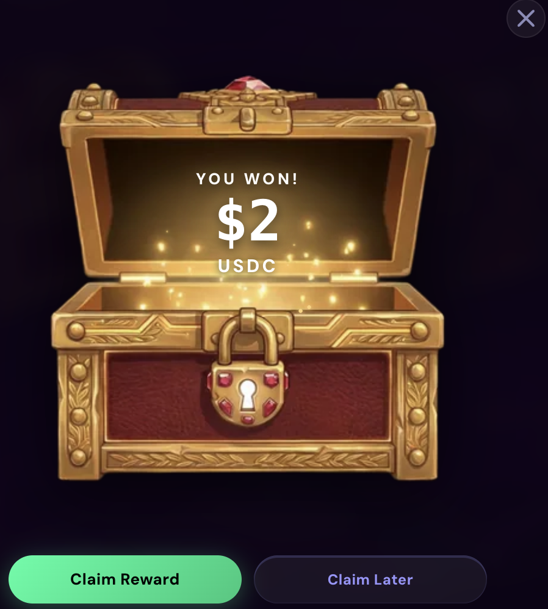

# Loot Boxes

Loot boxes are randomized reward drops earned through quests, milestones, and special events. Every box contains a prize — **points or USDC** — rolled at the moment you open it.

***

## Rarity Tiers

Four rarities, in ascending value:

| Rarity | Typical source | What's inside |
| --- | --- | --- |
| **Common** | Daily quests, basic milestones | Smaller point drops; occasional small USDC prizes |
| **Rare** | Weekly quests, mid-tier milestones | Bigger point drops; better USDC odds |
| **Epic** | High-value quests, major milestones | Large point drops; USDC prizes are common |
| **Legendary** | Exceptional events and rewards | The largest point and USDC prizes on the platform |

Higher rarity means better odds of USDC and bigger prizes on both sides of the roll. The exact contents are randomized when you open the box.

***

## How to Earn Them

* **Daily quests** — the primary source of Common boxes
* **Weekly quests** — Rare and occasionally better
* **Milestones** — one-time achievements unlock specific drops
* **Events** — Bonus Windows, vault campaigns, and session prizes sometimes pay in loot boxes

***

## Opening and Claiming

1. Open the **Colosseum** tab → **Inventory**.
2. Your unopened boxes are listed by rarity. Click one to open it — the reveal shows your prize.
3. **Claim the prize.** Every reward — points or USDC — has a claim step after the reveal. Points land in your total on claim; USDC payouts are queued and sent to your wallet.

<figure><figcaption>
Opening a box and claiming the reward
</figcaption></figure>


Each box opens exactly once — the roll is final the moment you open it. **Unopened boxes expire 30 days after they're granted** — the inventory shows a countdown on each box, so open them while they're live.

