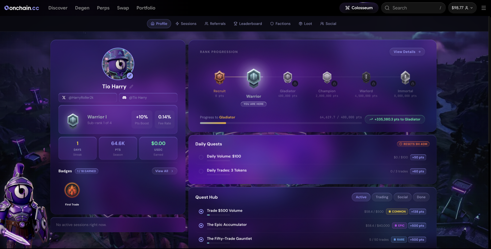

# What is Colosseum?

onchain.cc is the terminal. Colosseum is what makes it a competition.

Colosseum is the competitive layer that sits on top of everything you trade — spot, perps, Trenches, and predictions — converting activity into points, ranks, and real USDC rewards. The more you trade, the more you earn. The more you earn, the higher you climb. The higher you climb, the bigger your share of the prize pools.

***

## The Core Loop

```
Trade  →  Earn Points  →  Level Up Rank  →  Compete  →  Win
```

1. **Trade** on onchain.cc — any product, any size.
2. **Earn points** automatically based on your trading volume, boosted by your rank, faction, and active events.
3. **Level up your rank** as your lifetime points accumulate — higher rank means a bigger points boost and a lower swap fee.
4. **Compete** on session leaderboards against other traders.
5. **Win** USDC prizes as sessions and seasons pay out.

<figure><figcaption><p>The Colosseum dashboard</p></figcaption></figure>

***

## Key Features

| Feature | What it does |
| --- | --- |
| [**Seasons**](seasons-sessions.md) | Long-running campaigns with a global prize pool |
| [**Sessions**](seasons-sessions.md) | Short competitions — typically weekly — with their own leaderboards and prizes |
| [**Ranks**](ranks.md) | Six tiers from Recruit to Immortal — each with a higher points boost and a lower swap fee (0.15% → 0.10%) |
| [**Quests**](quests.md) | Daily, weekly, and one-time challenges paying bonus points, boosts, and loot boxes |
| [**Loot Boxes**](loot-boxes.md) | Reward drops in four rarities, containing points or USDC |
| [**Factions**](factions.md) | Team play — the top factions each week earn a points boost for every member |
| [**Vaults**](vaults.md) | Community campaigns: the whole platform trades toward a shared volume target to unlock rewards |
| [**Social Scoring**](social-scoring.md) | Quality posts about onchain.cc on X earn Colosseum progress |
| [**Leaderboard**](leaderboard.md) | Live session rankings — where you stand and what it takes to move up |

***

## You're already enrolled

There is no sign-up. Creating an account puts you on the ladder, and your first trade starts scoring — points, rank progress, quest tracking, and leaderboard entry are all automatic from there.


Colosseum tracks and rewards your trading — it never executes trades on your behalf. Your wallet remains fully in your control at all times.


***

## The current season

Season rewards, dates, and any live vault campaign are always shown on the **Colosseum dashboard** in the terminal. Season 2 carries **300,000 USDC** — a 200,000 prize pool plus 100,000 paid out while the season runs.
