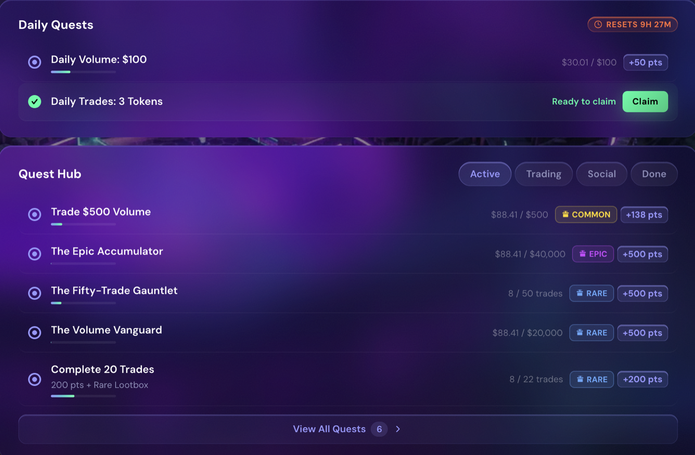

# Quests

Quests are structured challenges that reward you with bonus points, boosts, and loot boxes for doing things you'd be doing on the terminal anyway. They are the fastest way to accelerate rank progression on top of your trading.

***

## Quest Schedules

| Type | Cadence | Description |
| --- | --- | --- |
| **Daily** | Resets every day (00:00 UTC) | Short tasks you can complete in a single trading session |
| **Weekly** | Resets Mondays (00:00 UTC) | Larger goals rewarding sustained activity across the week |
| **One-Time** | Complete once | Exploration and achievement milestones — claimable for as long as the quest is live |


The reset wipes everything on daily and weekly quests — progress **and completed-but-unclaimed rewards**. Claim before the reset (daily at 00:00 UTC, weekly on Monday 00:00 UTC) or the reward is gone.


***

## What Quests Cover

* **Trading** — volume targets, trade counts, PnL milestones, across spot, perps, Trenches, and predictions (some quests are product-specific)
* **Social** — posting about onchain.cc on X, scored by the [Social Scoring](social-scoring.md) system
* **Referrals** — inviting traders who go on to trade
* **Achievements** — first trade, first deposit, opening a loot box, reaching a rank, joining a faction
* **Factions** — collective goals where your whole faction's activity counts toward one target
* **Streaks** — daily-login and consistency rewards

***

## Rewards

| Reward | What it does |
| --- | --- |
| **Points** | Count toward your lifetime total — building your rank and its permanent boost |
| **Loot Boxes** | Reward drops — see [Loot Boxes](loot-boxes.md) |
| **Boosts** | Temporary points multipliers, and other time-limited perks |

***

## Finding and Claiming Quests

1. Open the **Colosseum** tab and select **Quests**.
2. Quests are grouped by schedule — each card shows the objective, the reward, a progress bar, and time remaining.
3. When a quest completes, **claim it** from the card. Most rewards are claimed manually; some quests auto-claim on completion. Make claiming a habit — daily and weekly rewards are lost at the reset if left unclaimed.

<figure><figcaption>
The quests panel
</figcaption></figure>
