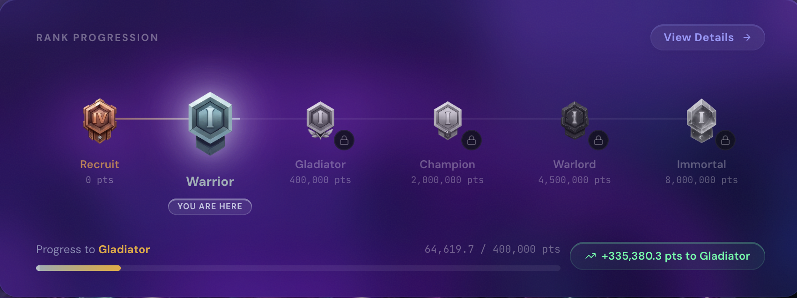

# Rank System

Your rank is your standing in the Colosseum. It reflects your **lifetime points** — everything you have earned across all sessions and seasons — and it directly improves two things: how fast you earn points on every future trade, and the **swap fee** you pay.

***

## The Six Ranks

The current rank ladder and fee schedule:

| Tier | Rank Name | Subtiers | Swap Fee |
| ---- | --------- | -------- | -------- |
| 1    | Recruit   | 1–4      | 0.15%    |
| 2    | Warrior   | 1–4      | 0.14%    |
| 3    | Gladiator | 1–4      | 0.13%    |
| 4    | Champion  | 1–4      | 0.12%    |
| 5    | Warlord   | 1–4      | 0.11%    |
| 6    | Immortal  | 1–4      | 0.10%    |

Each rank applies a **points multiplier** to everything you earn — the higher your rank, the more points the same trade generates — on top of reducing your swap fee. Rank is based on lifetime points, so ranking up is permanent: the higher multiplier and the lower fee apply to every trade from that moment on.

***

## Subtiers (1–4)

Each rank divides into four subtiers — Recruit 1 through Recruit 4, then Warrior 1, and so on. Subtiers are purely positional: they show progress *within* a rank, and that's all. Your fee and multiplier are set at the rank level — Recruit 1 and Recruit 4 pay the same fee and earn at the same rate.

<figure><figcaption><p>Rank progression in the app</p></figcaption></figure>

***

## Swap Fee Reduction

Every rank step cuts your fee on **Swap and Trenches** trades by 0.01 percentage points, from 0.15% at Recruit down to the floor of **0.10% at Immortal** — a 33% reduction, locked in for life. It applies automatically: nothing to claim, no token to hold.


Spot and Perps fees follow Hyperliquid's separate schedule — see [Spot Fees](../spot/fees.md) and [Perps Fees](../perps/fees.md).


***

## How Points Are Earned

Every trade generates points from its **volume**, scaled by a base rate for the product, and then boosted:

```
Points = Volume × Base Rate × (1 + your active boosts)
```

Boosts **add together** before applying — they come from:

* **Your rank** — the biggest and most permanent boost
* **Your faction** — if it placed in the top factions by weekly volume ([Factions](factions.md))
* **Bonus Windows** — time-limited events ([Seasons & Sessions](seasons-sessions.md))
* **Season boosts** — active campaign multipliers
* **Quest boosts** — temporary multipliers earned as quest rewards ([Quests](quests.md))

Deposits, first-trade milestones, referrals, and quest completions award additional fixed points on top of trading.

***

## How to Rank Up

1. **Trade volume.** Points accumulate with every trade, on every product. No minimum size.
2. **Complete quests.** Bonus points count toward your lifetime total.
3. **Stack your boosts.** A high rank, an active faction, and a Bonus Window compound the rate at which the same volume earns.
4. **Stay active.** Lifetime points never reset — every session adds to your rank progress.
