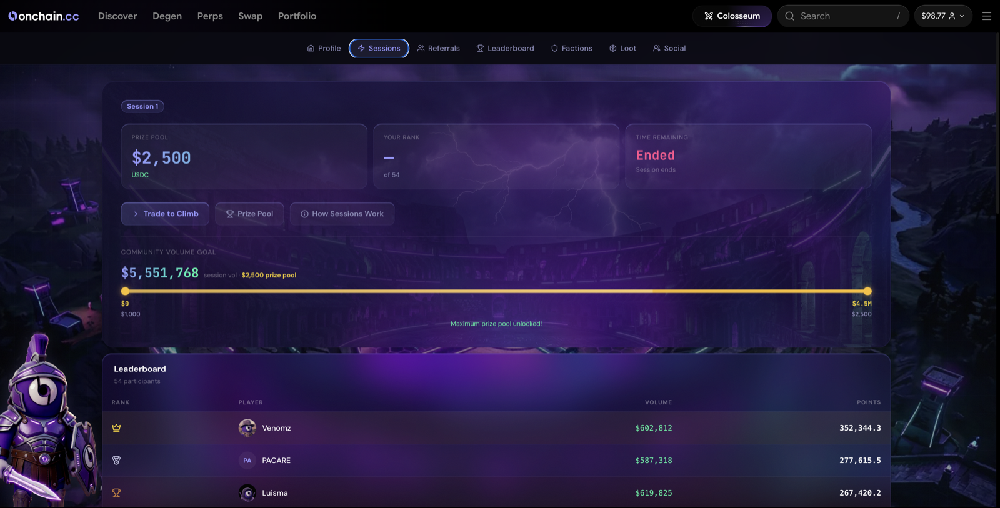

# Seasons & Sessions

Colosseum runs on two overlapping competition clocks — a long game and a short game. Understanding both is how you maximize your rewards.

***

## Seasons

A **Season** is the long-running campaign that frames everything else. Seasons run for weeks to months and carry a global prize pool — the headline number on the Colosseum dashboard.

* Each season has announced dates and a total prize pool.
* Season-wide **boosts** can apply while a season is active — including boosts targeted at specific products or events.
* When a season ends, prizes settle and a new season opens with a fresh campaign.

***

## Sessions

A **Session** is the short competition that runs inside a season — **typically weekly**, with its exact start and end announced on the dashboard. Each session has:

* Its own **leaderboard**, scored from zero — points earned during that window only.
* Its own **prize pool** and payout structure.
* A defined **scoring metric** — most sessions rank by points, but sessions can also rank by PnL, return, or trade count, and some are scoped to one product (a perps-only session, a Trenches-only session). The session card always states its rules.
* Some sessions run in **rank brackets**, so you compete against traders at a similar level.

When a session closes, the leaderboard is final and prizes are calculated. **Payouts follow about a week after the session ends** — a verification window before funds move. See [Leaderboard](leaderboard.md).


Sessions never touch your lifetime points — rank progress carries across every session and season you play.


***

## Bonus Windows

Inside a season, the Colosseum team activates **Bonus Windows** — time-limited events that boost point earnings for eligible trades. Examples:

* "2x points for the next 4 hours"
* "Boosted points on prediction trades this weekend"
* Faction-only or campaign-specific boosts

Bonus Windows are announced on the Colosseum dashboard and in the official Discord, with a countdown while active. When more than one boost applies to a trade, the boosts **add together**. Trading during a Bonus Window is the fastest way to climb a session leaderboard.

***

## How to know what's active

Open the **Colosseum** tab. The dashboard shows the active season and prize pool, the current session with its countdown and rules, any live vault campaign, and any Bonus Window in effect. Check it before a trading session — knowing when a boost is coming lets you plan around it.

<figure><figcaption>
Season, session, and Bonus Window status
</figcaption></figure>
