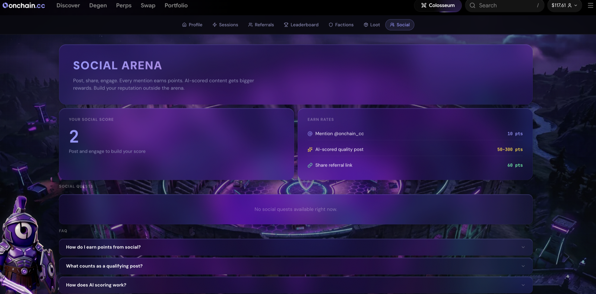

# Social Scoring

You can earn Colosseum progress for posting about onchain.cc on X. Social scoring rewards genuine advocacy — real takes, real trades, real engagement — not spam.

***

## How It Works

1. **Post on X** mentioning **@Onchaincc** or using **#onchaincc**. (Retweets don't count — original posts, quotes, and replies do.)
2. The post is picked up automatically — no submission step.
3. An AI scoring system grades the post on **content quality**: relevance, substance, insight, and authenticity.
4. Scored posts feed your Colosseum progress — social quests track them, and your recent posts and their results are visible in the **Social** panel.

<figure><figcaption>
The Social panel
</figcaption></figure>

***

## What Scores Well

* A specific insight, trade, or observation from your own use of the terminal
* A screenshot of a position, a PnL card, or a leaderboard placement
* A genuine opinion — including critical ones argued well
* Content your followers actually engage with

## What Scores Zero

* Bare referral links and generic "go check out" filler
* The same text posted repeatedly, or near-duplicates
* Spam, engagement-bait, or off-topic tag-ons
* Hate, harassment, or anything that gets a post flagged rather than scored

***

## Fair Use

The system is built to reward participation, not gaming. Spam, duplicates, and manipulated engagement don't score, and accounts running systematic manipulation can be disqualified from social rewards.

***


The easiest high-scoring post is the one you'd make anyway: the trade that hit, the feature that saved you, the leaderboard climb. Share the PnL card straight from the terminal and say what happened.

