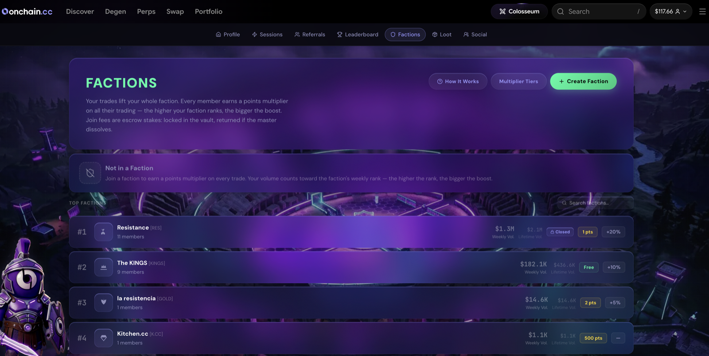

# Vaults

A Vault is a community campaign: the platform announces a **collective volume target** and a prize pool, and every eligible trade on onchain.cc pushes the community toward it. Hit the target together, unlock the rewards together.

***

## How a Vault Campaign Works

1. **The vault opens** — a volume goal, a prize, and a deadline are announced on the Colosseum dashboard and in Discord.
2. **Everyone trades** — qualifying trades during the vault window count automatically. No opt-in, nothing to click. (Campaigns can set a minimum trade size for a trade to count — the vault card states it.)
3. **Progress is live** — a progress bar tracks community volume against the target in real time. Some campaigns unlock rewards in **stages** as milestones fill, with the full prize at the top.
4. **The vault unlocks** — hitting the target locks in the reward. Once a milestone is announced, it can't un-fire.

<figure><figcaption>
A live vault campaign — progress toward the community target
</figcaption></figure>

***

## How Rewards Are Distributed

What a vault unlocks depends on the campaign. Some vaults unlock a prize distributed to contributors; others fill a **downstream pool** — for example, the campaign that maxed Season 2's 300,000 USDC prize pool, which then pays out through the season's own competitions. Every vault's card states its own payout rules — read it when the campaign opens.

***


Only volume during the active vault window counts — trades before it opens or after it closes don't contribute. Check the vault card for the campaign's own rules: the window, any minimum trade size, and how its rewards pay out.

