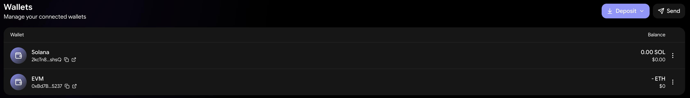

# Funding Your Account

Everything on onchain.cc runs from your self-custody wallets, with three products keeping their own trading balance: your **wallet** (used by Swap and Trenches), **Perps/Spot** (one shared Hyperliquid balance), and **Predictions**. This page covers getting money in, moving it between products, and getting it out.

***

## Adding funds

Open **Add funds** from the header balance menu or the Portfolio page. Two tabs:

### Cash — buy with card or mobile pay

* Buy **USDC** directly in a secure checkout — card, or Apple Pay / Google Pay where available — delivered to your wallet on **Solana** or **Base** (you pick the delivery chain).
* **Minimum purchase: $20.** Quick amounts from $50 to $1,000, or enter your own.
* Pay in USD by default; other major currencies are supported in the checkout.
* After purchase, the terminal watches for the funds to arrive and confirms with a notification — card settlements typically land within minutes.

<!-- 📸 SCREENSHOT NEEDED: Add Funds dialog — Cash tab with Apple Pay marks -->

### Crypto — deposit or pull from another wallet

* **Deposit** — copy your address or scan the QR code. Solana and all supported EVM chains (Ethereum, Base, Arbitrum, Optimism, Polygon, BNB, Linea, Scroll, Gnosis, Berachain, Robinhood) are accepted.
* **Connect wallet** — connect Phantom, MetaMask, or another external wallet and transfer funds across in a guided flow without leaving the terminal.

<figure><figcaption>
Depositing crypto to your wallet address
</figcaption></figure>

***

## Moving funds between products

Use **Transfer** from the header balance menu or the Portfolio page. Transfers always run between your wallet and a product balance:

| Product balance | Used by | Deposit minimum | Withdrawal |
| --- | --- | --- | --- |
| **Perps/Spot** | The Hyperliquid order-book terminal. Perps and Spot share one USDC balance — there is nothing to move between them. | $10 | Minimum $2, $1 Hyperliquid fee; arrives as USDC on Arbitrum |
| **Predictions** | Prediction markets. | $2 | Arrives as USDC.e on Polygon, 1:1, no onchain.cc fee |

Two deposit speeds for Perps/Spot:

* **Instant** — arrives in seconds; routing fee may vary.
* **Standard** — cheaper; takes a few minutes.

You can fund from any supported chain — the terminal routes and bridges automatically.

<!-- 📸 SCREENSHOT NEEDED: Transfer Funds dialog — moving USDC into Perps/Spot -->

***

## Gas fees

Trades on Swap and Trenches settle on-chain, so the network charges a small gas fee in the chain's native token (SOL on Solana, ETH on Ethereum, and so on) — separate from any platform fee.

* On most supported EVM chains, **gas is sponsored** — you can trade without holding the native token.
* On **Solana, Ethereum, and BNB**, keep a small native-token balance for gas or transactions will fail. On Solana a few thousandths of a SOL covers a trade; hold a little more than you think you need.

Perps, Spot, and Predictions trade against product balances, so individual orders there don't need gas from your wallet.

***

## Getting money out

Everything flows back to your wallet, and from there anywhere you like:

1. **Withdraw product balances** — Perps/Spot withdrawals arrive as USDC on Arbitrum; Predictions withdrawals as USDC.e on Polygon.
2. **Send from your wallet** — use **Send** on the Portfolio or Wallets page to transfer any asset to any address, including an exchange account.

There is no in-app cash-out to a bank card yet — to convert back to fiat, send funds to your exchange of choice (Bitso included) and withdraw from there.

***


Withdrawals from product balances go to your own wallet — onchain.cc never holds your funds at any step.

