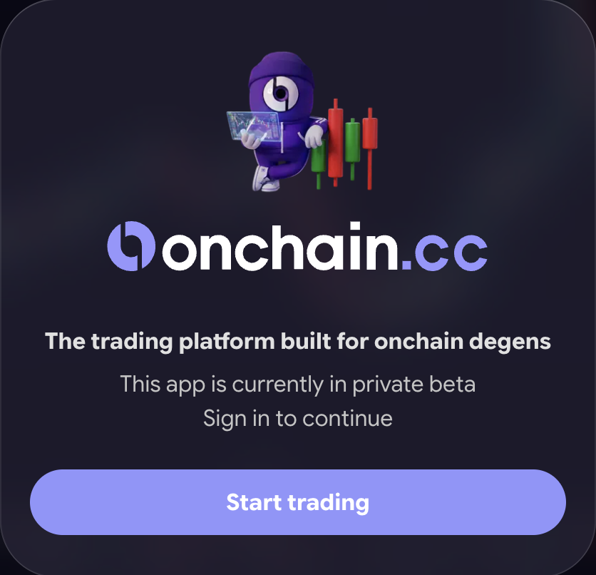
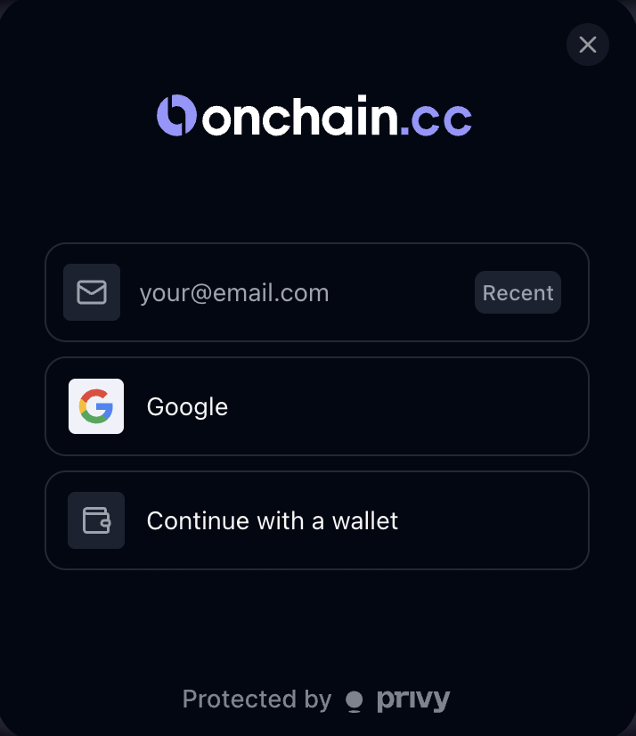
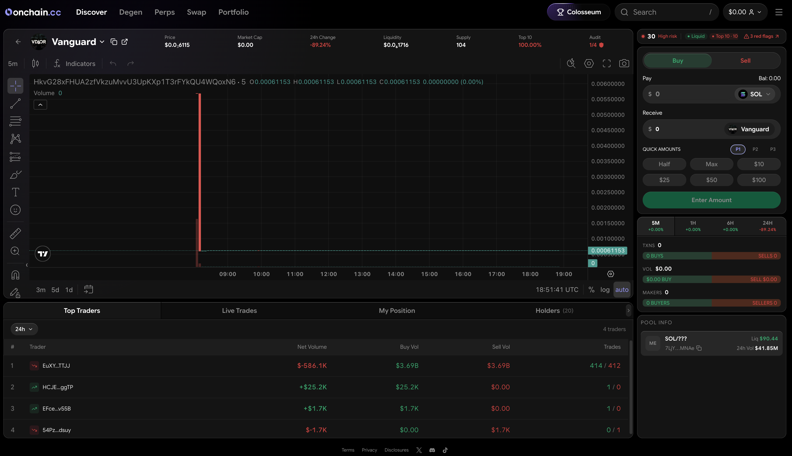

# Quick Start Guide

## Get trading in 4 steps

You can go from zero to your first trade in a few minutes. Here is exactly how.

***

### Step 1 — Go to onchain.cc

Open your browser and navigate to [onchain.cc](https://onchain.cc).

<figure><figcaption>
The onchain.cc landing page
</figcaption></figure>


Always use the official domain — **onchain.cc**. Do not use links from DMs, social posts, or search ads. Bookmark the site after your first visit.


***

### Step 2 — Sign in

Click **Log in** and choose how you want to authenticate:

* **Google** — one-click sign-in with your Google account
* **Email** — enter your address and confirm the 6-digit code
* **Wallet** — connect an existing Solana or EVM wallet (Phantom, Solflare, Backpack, MetaMask, Rabby, and other supported wallets)

Authentication is handled by **Privy**, a non-custodial wallet infrastructure provider. Signing in with Google or email gives you embedded self-custody wallets — one for Solana, one for EVM chains — that only you control. You can view both, and export their private keys, on the **Wallets** page at any time.

<figure><figcaption>
Sign in with email, Google, or a wallet
</figcaption></figure>

***

### Step 3 — Add funds

Open **Add funds** from the header. You have two routes:

* **Cash** — buy USDC directly with a card or mobile pay (Apple Pay / Google Pay, where available) in a secure checkout. Minimum $20.
* **Crypto** — deposit to your wallet address (Solana or any supported EVM chain), or connect an external wallet like Phantom or MetaMask and pull funds across in a guided flow.

One thing to know up front: your **wallet** funds Swap and Trenches directly, while **Perps/Spot** and **Predictions** each have their own balance you fund via **Transfer**. See [Funding Your Account](funding.md) for the full picture.

***

### Step 4 — Pick a product and trade

* **Know the token?** Paste its contract address (CA) or ticker into the search bar to pull up its chart and trading panel.
* **Hunting launches?** Open **Trenches** for the live scanner of new and graduating tokens.
* **Trading majors?** Open **Perps/Spot** for the order-book terminal.
* **Have a view on an event?** Open **Predictions** and buy Yes or No.

<figure><figcaption>
A token trading page — chart, stats, and trade panel
</figcaption></figure>

Your first trade also enrolls you in [Colosseum](../colosseum/overview.md) — points, rank, and prize-pool standing start accumulating automatically.

***


You are live. Every trade routes through aggregated liquidity with some of the lowest fees in the market — and every trade earns Colosseum points.


***

Next up: [Key Concepts & Glossary](key-concepts.md) — or jump straight into the product docs for [Spot](../spot/overview.md), [Perps](../perps/overview.md), [Trenches](../trenches/overview.md), or [Predictions](../predictions/overview.md).
