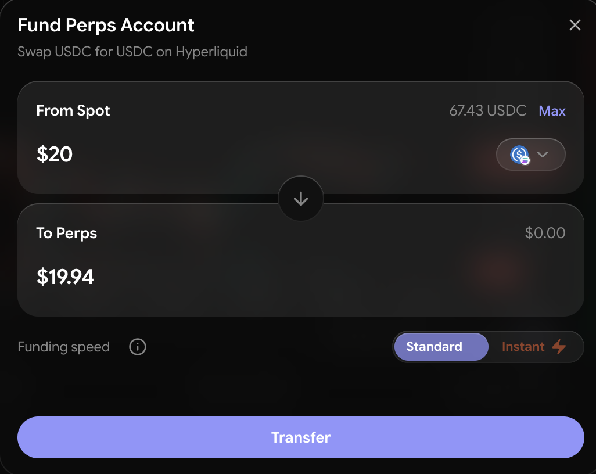
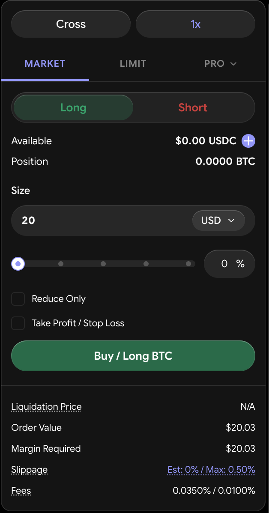

# How to Open a Position

Opening a perps position takes under a minute once your account is funded. Work through each step in order — the order summary shows you the full picture before any funds move.

***

## Steps

### 1. Go to the Perps Terminal

Open **Perps/Spot** from the navigation and select a perps market.

### 2. Fund Your Balance

Perps trade from the shared **Perps/Spot USDC balance**. Click **Transfer**, fund from any supported chain (minimum $10 — the terminal routes it automatically), and you're ready. You can withdraw unused balance back to your wallet at any time from the same flow.

<figure><figcaption>
Funding the shared Perps/Spot balance
</figcaption></figure>

### 3. Select the Market

Use the market selector to choose what you want to trade. Each market has its own maximum leverage — majors like BTC and ETH support the highest, smaller caps less. Builder-deployed markets (stocks, commodities, forex, indices) carry a badge.

### 4. Choose Your Direction

* **Long** — you profit if the price rises
* **Short** — you profit if the price falls

### 5. Choose a Margin Mode

| Mode | Behaviour | When to use |
| --- | --- | --- |
| **Isolated** (default) | Locks a specific amount of collateral to this position only. A liquidation here cannot touch your other positions or free balance. | When you want a single position's risk fully ringfenced. |
| **Cross** | Shares collateral across all your cross positions. Unrealised PnL on winners offsets margin demand on losers. | Managing multiple correlated positions with capital efficiency. |

You can't change the margin mode while a position is open in that market — close it first.

### 6. Set Your Leverage

Use the leverage control or type a value. The maximum is market-specific and shown on the slider.


Higher leverage means your liquidation price is closer to your entry. A 10x position can be liquidated by roughly a 10% adverse move; a 40x position by ~2.5%. Most experienced traders use 2–5x.


### 7. Enter Your Position Size

Enter either the **notional size** (total position value) or the **margin amount** (collateral to put up). Required initial margin is `position size ÷ leverage`, and the panel shows both values alongside the USDC requirement. Minimum order value is $10.

### 8. Choose Your Order Type

| Order type | How it works | When to use |
| --- | --- | --- |
| **Market** | Executes immediately at the best available price, within your slippage tolerance. | You prioritise speed over price. |
| **Limit (GTC)** | Rests on the book at your price until filled or cancelled. | Price control; willing to wait. |
| **Limit (IOC)** | Fills immediately up to your limit; cancels any remainder. | Price control without leaving an order resting. |
| **Limit (ALO / post-only)** | Adds to the book and never executes immediately — guarantees the maker rate. | Providing liquidity at the cheapest fee. |
| **Stop Market** | A market order that triggers when the mark price hits your trigger level. | Breakout entries and defensive exits. |
| **Stop Limit** | A limit order that activates at your trigger price. | Trigger-based entries with a fill cap. |
| **Take Profit Market / Limit** | The mirror of stops — triggers when price moves in your favour. | Automated profit-taking. |
| **TWAP** | Splits the order into slices over 5 minutes to 24 hours, with optional randomized timing. Minimum notional scales with duration (roughly $10 per minute). | Sizing into or out of a large position with minimal impact. |

A **Reduce Only** option restricts an order to closing existing exposure — it can never increase your position.

<figure><figcaption>
The perps order entry panel
</figcaption></figure>

### 9. Review the Order Summary

Before confirming, check:

* **Entry price** — where the position opens
* **Liquidation price** — where it would be forcibly closed
* **Required margin** — USDC locked as collateral
* **Estimated fees** — the combined maker/taker rate for this order (see [Fees](fees.md))

### 10. (Optional) Attach Take-Profit and Stop-Loss

You can attach TP/SL orders during entry — they arm only once the entry order fills, and they trigger off the **mark price**. See [How to Close a Position](how-to-close.md).

### 11. Confirm

Click **Confirm** to submit. The position appears in the Positions panel once it fills.

***

## After Opening

* Set or verify your **take-profit** and **stop-loss** — see [How to Close a Position](how-to-close.md).
* Monitor the **funding rate** — see [Fees](fees.md#funding) for how it affects your holding cost.
* Watch your **liquidation price** — especially in volatile markets.
