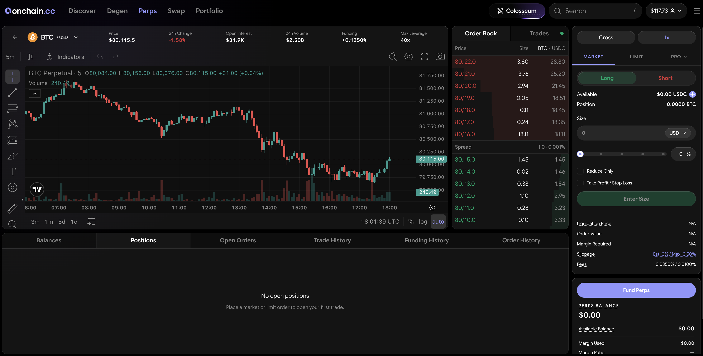

# Perps Overview

Perpetual futures (perps) let you trade long or short with leverage — no expiry date, no rolling contracts. You hold the position until you close it, or until liquidation forces it shut.

<figure><figcaption>
The perps terminal — chart, order book, and order entry
</figcaption></figure>

***

## Where Perps Live

Perps share the **Perps/Spot** terminal with [Spot](../spot/overview.md). The two products also share **one USDC balance** — fund it once via the **Transfer** flow and both can use it. Margin locked by open perps positions reduces what's spendable on Spot, and the account panel shows total and available at all times.

Beyond crypto, the perps market list also includes **builder-deployed markets for stocks, commodities, forex, and indices** — marked with a badge in the markets list. These trade like any other perp in the terminal — long or short, with leverage — but track non-crypto assets; each market's leverage cap and specifics are shown on the market itself.

***

## Spot vs. Perps

|              | Spot                   | Perps                                      |
| ------------ | ---------------------- | ------------------------------------------ |
| What you own | The asset itself       | A leveraged contract on the price          |
| Expiry       | None                   | None (perpetual)                           |
| Leverage     | No                     | Yes — set per market, up to 40x on majors  |
| Direction    | Long only (you own it) | Long or short                              |
| Costs        | Maker/taker fee        | Maker/taker fee + hourly funding           |
| Settlement   | Fills to your balance  | Continuous, with funding payments          |

With perps you never hold the asset — you hold a contract that tracks its price. You can go long (profit if price rises) or short (profit if price falls).

***

## Powered by Hyperliquid

The onchain.cc perps product is built on Hyperliquid's execution layer. You get the onchain.cc interface and experience — Hyperliquid handles order matching, mark pricing, funding, and settlement under the hood. You do not need a separate Hyperliquid account.

***

## Key Concepts

Before opening a position, understand these four mechanics. Each has its own page with full detail.

| Concept                                | What it means                                                                                |
| -------------------------------------- | -------------------------------------------------------------------------------------------- |
| [Leverage & Margin](leverage.md)       | Leverage multiplies exposure; margin is the collateral that backs the trade.                 |
| [Funding](fees.md#funding)             | Hourly payments between longs and shorts that keep the perp price anchored to spot.          |
| [Liquidation](leverage.md#liquidation) | Automatic close when your margin falls below the maintenance threshold.                      |
| [Fees](fees.md)                        | Hyperliquid's volume-tiered maker/taker rate plus a small Onchain service fee.               |

***


Perps involve leverage and carry significantly higher risk than spot trading. Only trade with capital you can afford to lose. New to perps? Start at 1–2x leverage while you learn the mechanics.

