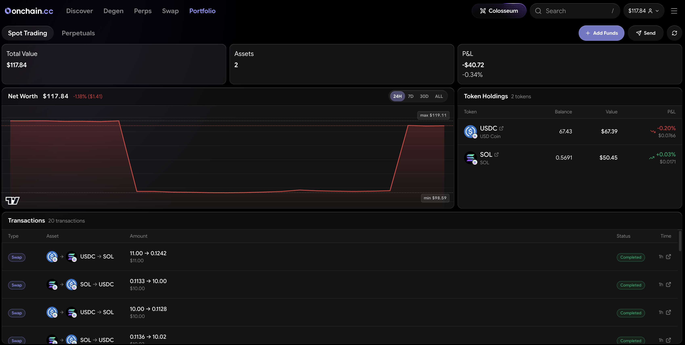

# Portfolio

Portfolio is your consolidated view of everything you hold and trade on onchain.cc — across your wallet and all product balances — with live values, PnL, and one-tap access to funding actions.

<figure><figcaption>
The Portfolio view
</figcaption></figure>

***

## Four tabs

| Tab | What it covers |
| --- | --- |
| **Wallet** | Tokens held in your self-custody wallets (Solana + EVM) — what Swap and Trenches trade with |
| **Spot** | Your Hyperliquid spot holdings and the shared Perps/Spot balance |
| **Perps** | Open perps positions, fills, and funding payments |
| **Predictions** | Prediction positions, open orders, and history |

The header shows your total balance across everything, with per-venue breakdowns (available, in positions, in open orders), an eye toggle to hide balances, and per-tab actions: **Add funds**, **Send**, **Transfer**, and **Deposit** where relevant.

***

## Wallet tab

* **Net worth chart** — your combined wallet value over time, from 24 hours to all-time.
* **Holdings** — every token with balance, live price, value, average entry, and realized/unrealized PnL where cost basis is available. Dust and unwanted tokens can be hidden.
* **Transaction history** — your on-chain activity, continuously scrollable.

Click any holding to open it in the terminal ready to trade.

***

## Spot, Perps, and Predictions tabs

Each product tab mirrors what its terminal shows, in one place:

* **Spot** — total and available balance (shared with Perps), holdings, and recent activity.
* **Perps** — account value, available margin, open positions with live PnL and liquidation prices, fills, and funding payment history, plus a PnL chart.
* **Predictions** — positions with value / PnL / To Win, open orders, trade history, and a cumulative PnL chart.

***

## PnL: unrealized vs. realized

* **Unrealized PnL** — what your open holdings are worth against your entry. Moves in real time; not locked in until you close.
* **Realized PnL** — profit or loss from closed positions. Final.

Any position — spot, perps, Trenches, or predictions — can be shared as a **PnL card**: copy the image, download it, or post to X directly.

***

## Moving money

The **Transfer** flow moves funds between your wallet and product balances (Perps/Spot, Predictions) — see [Funding Your Account](../getting-started/funding.md) for minimums, speeds, and withdrawal details.

***


Portfolio reads your connected wallets and product balances in real time — onchain.cc never holds your funds.

