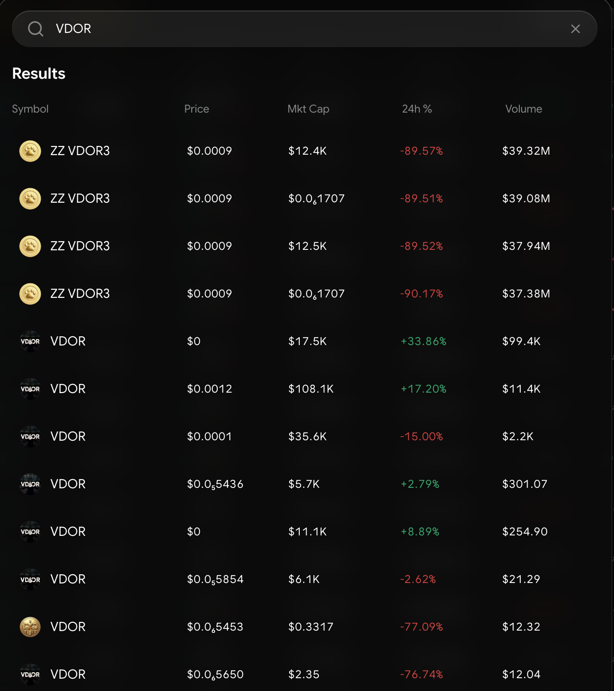

# Cross-Chain Swap

Swap converts any token into any other token across **12 supported chains** — same-chain or cross-chain, in one transaction flow, with automatic best-price routing. It trades straight from your wallet: no order book, no product balance to fund, full self-custody.

***

## Supported chains

**Solana · Ethereum · Base · Arbitrum · Optimism · Polygon · BNB · Linea · Scroll · Gnosis · Berachain · Robinhood**

Swap both within and between them — Solana ↔ EVM included. On most EVM chains **gas is sponsored**, so you can trade without holding the native token; on Solana, Ethereum, and BNB keep a small native-token balance for gas.

***

## How routing works

You never pick a route — the terminal does:

* **Solana ↔ Solana** swaps route through **Carbium**, onchain.cc's Solana routing engine, which splits your order across DEX liquidity for the best output. MEV protection is on by default.
* **Cross-chain and EVM** swaps route through **LiFi**, which finds the best bridge-and-swap path between chains.

The quote shows your expected output, price impact, and the route before you confirm — quotes refresh every 10 seconds while you decide.

***

## How to swap

1. **Pick your tokens** — the token you're paying with (and its chain) and the token you want (and its chain). Search by name or paste a contract address.

<figure><figcaption>
Search by name, ticker, or contract address
</figcaption></figure>
2. **Enter the amount** — in tokens or USD, with quick presets and 50%/MAX buttons.
3. **Check the quote** — expected output, price impact, and fee. Adjust slippage in the settings if needed (default 1%; presets from 0.1% to 5%).
4. **Confirm** — approve the transaction and the swap executes. Large trades (over ~$1,000) ask for one extra confirmation.

That's the whole flow. Sells work identically — flip the pair.

<!-- 📸 SCREENSHOT NEEDED: Swap panel with a live quote (route + fee rows visible) -->


Slippage protects you: if the price moves beyond your tolerance before the transaction lands, the trade reverts rather than filling at a worse price. The panel warns you when a setting or a quote looks risky (slippage above 3%, price impact above 10%).


***

## Swap vs. Spot

Swap is instant conversion from your wallet across 12 chains. [Spot](../spot/overview.md) is order-book trading on Hyperliquid — limit orders, TWAPs, maker/taker fees — from a funded product balance. Converting tokens? Swap. Working orders on liquid pairs? Spot.

***

## Quick Swap on the Dashboard

The full swap panel is also available as the **Quick Swap** [Dashboard widget](../portfolio/dashboard.md) — same chains, same routing, same fees, embedded in your board.

***


Every swap settles on-chain and is verifiable on the relevant chain's explorer from the confirmation screen. Completed swaps land in your wallet and appear in [Portfolio](../portfolio/portfolio-view.md).

